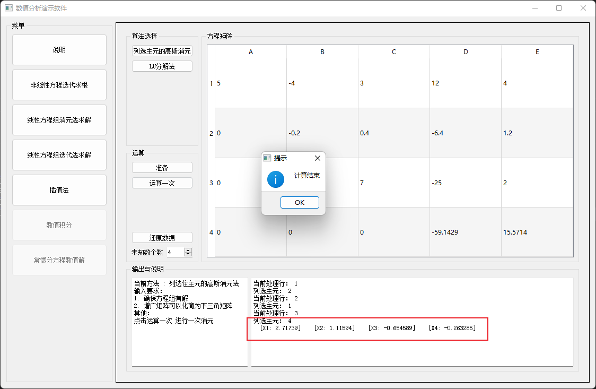

# 数值分析算法演示软件

## 环境

1. Qt 5.12 

2. mingw_8.1.0

3. IDE: vscode & clion

## 说明

采用qt作为图形界面，以可视化的方式来展示数值分析中的算法。

> 初心将数值分析的每一个算法都去完成一边，最后却变成了搪塞老师作业。
>
> 带后续有时间了，慢慢完善每一个算法。

实现算法：

- [x]  二分法
- [x] 一般迭代法
- [x] 牛顿迭代法
- [x] 高斯消元法
- [x] LU分解法
- [x] 雅可比迭代法
- [x] 拉格朗日插值法

目前程序还没有正式完成，还有众多算法等我实现。

由于程序的初心时为了以可视化的方式去理解 《数值计算方法》, 我将每一个算法都以合理的方式拆成一个小步，一步步的展示算法的效果，方便我们学习和理解。

> 最近有点忙 ，目前先不填这个坑了，后续完善readme
>
> 程序还在建设中，有错误请谅解

## 效果截图

#### 主页

#### 非线性方程迭代求解

#### 线性方程组的消元法求解

#### 线性方程组 迭代法求解

#### 插值法

